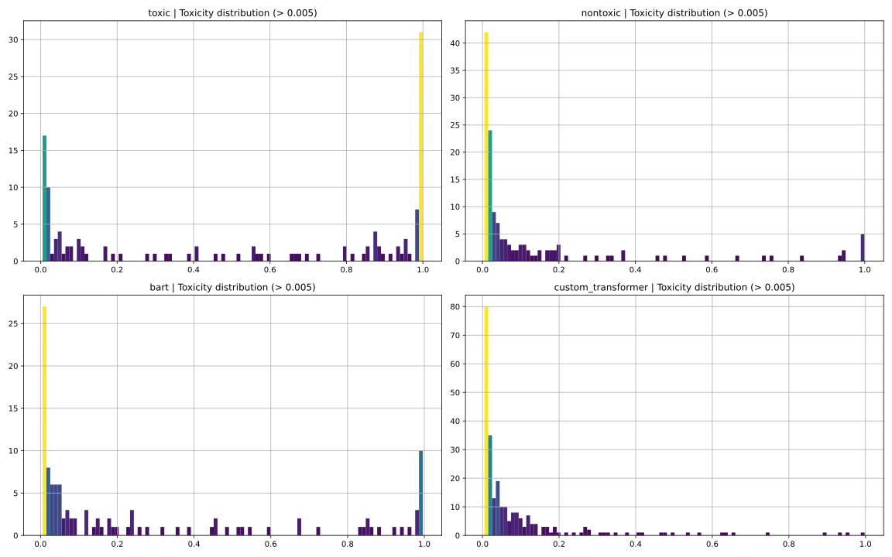

# Report

for PMLDL Assignment 1, Innopolis University

by Dmitry Beresnev (d.beresnev@innopolis.university)

## Introduction

The given task is to build model(s) for solving text detoxification task: given “toxic” input text, generate the “non-toxic” analogue. I propose two models: built from scratch custom torchtext Transformer (Custom Transformer) and fine-tunned BART (BART) to solve the given task. I decided to include both models in final report as they bath are different and it was interesting for me to compare them in the final. That results, in particular, in the fact that you can use both models in the `src/models/train_model.py` and `src/models/predict_model.py` scripts specifying `-m` argument (check `-h` of the scripts for more details).

In this report I describe and compare both models as well as the training process and evaluation metrics.Also I explain the way I pre-process given dataset and the reasons behind such choices. At the end I make a conclusion about work what have been done during this assignment.

## Data analysis

Initial dataset contains reference and translated texts (where “translated” means “detoxified”) as well as corresponding toxicity scores named `ref_tox` and `trn_tox` defined by human. The following pre-process steps are done on the initial dataset:

1. Swap `ref_tox` and `trn_tox` columns for data point with `ref_tox`<`trn_tox` .
2. Remove data points which are quite similar to each other
   1. Remove rows with `similarity` > 0.94
   2. Remove rows with `lenght_diff` < 0.02

The last two threshold values were obtained empirically and are chosen in a way not to dramatically reduce dataset size and not to filter out short, but still representative rows. For example, rows where reference and translated texts consist of only couple of words, `similarity` can be quite high. Also rows where in order to remove toxicity the toxic word in the reference text is replaced by neutral synonym with almost the same size in the translated text can have very low `lenght_diff` .

Initial dataset also is quite big (577 777 rows) and previously described steps do not reduce this amount noticeably. Also some rows in the dataset is not very representative as `ref_tox` is not quite big and/or `trn_tox` is not quite low. To reduce number of rows and train models only on representative data, I decided to build several train datasets of different sizes. Size map is the following:

```python
size_map = {
	"lg": {"toxicity_threshold": 0.9, "no_toxicity_threshold": 0.1},
	"md": {"toxicity_threshold": 0.99, "no_toxicity_threshold": 0.01},
	"sm": {"toxicity_threshold": 0.999, "no_toxicity_threshold": 0.001},
	"xs": {"toxicity_threshold": 0.9994, "no_toxicity_threshold": 0.0001},
}
```

Here, `toxicity_threshold` is threshold for `ref_tox` and `no_toxicity_threshold` is threshold for `trn_tox` . Also I save 500 rows for testing and evaluating models on potentially unseen data in the `test.csv` .

As a result of this stage I have 5 files which can be found in `data/raw`: `dataset_lg.csv`, `dataset_md.csv`, `dataset_sm.csv`, `dataset_xs.csv` for training and `test.csv` for testing purposes. The different sizes are useful for reducing the training time of the model and resources consumption without loosing the representativeness of the dataset.

## Models specification

Specifications of both proposed models are described in the corresponding sections.

### Custom Transformer

The idea was to create Transformer architecture from scratch using PyTorch and Torchtext libraries. I also add the **positional encoding** layer to make model better understand the internal text
structure and **embedding layer** to learn task-specific embeddings. [Here](https://pytorch.org/tutorials/beginner/translation_transformer.html) you can find the corresponding tutorial I used.

As a tokenizer, SpaCy tokenizer with _`language_="en_core_web_sm"` is used. Special tokens are unknown token (<unk>), padding token (<pad>), begin-of-sentence token (<bos>) and end-of-sentence token (<eos>).

Max size of the text is set to 100, and if the text is less than that number, the padding tokens are added.

The main architecture of Custom Transformer is following:

- Positional encoding layer with `EMBEDDING_SIZE=320` and dropout ratio 0.1
- Input and output embedding layers with `EMBEDDING_SIZE=320`
- PyTorch Transformer layer with 8 heads , `FEED_FORWARD_DIM=512` , 4 encoder layers, 4 decoder layers and dropout ratio 0.1
- Generator (linear layer) which maps embedding to vocabulary

The parameters are taken not to have very huge model, but and the same time not to have very small model which will not be able to solve the given task. Overall model is build on top of the PyTorch `nn.Module`.

### BART

The BART model use a standard sequence-to-sequence architecture with a bidirectional encoder and left-to-right encoder proposed in 2019. This architecture is particularly effective for text generation tasks, but also works well for comprehension tasks. That is why I decided to fine-tune pre-trained BART to solve text detoxification task.

I found [this](https://huggingface.co/eugenesiow/bart-paraphrase) BART model on the Hugging Face Hub, what was pre-trained on several paraphrase datasets. As text detoxification task may also be considered as text paraphrase task, this model perfectly fits my requirements.

Also this model includes pre-trained tokenizer, which I decide to use in this assignment. Data collator is also built from included tokenizer and checkpoint.

Max size of the text is set to 128, and if the text is less than that number, the padding tokens are added. If the length of text is greater than 128, text is simply truncated.

To make the BART work with text detoxification task, I come up with the following input prefix: `PREFIX = "paraphrase following to be nontoxic: \n”` .

## Training Process

I train both models on CUDA 11.8 and Python 3.11. Predictions for further evaluations are main on `train.csv` data.

### Custom Transformer

To save training time and computational resources consumption, I use `dataset_md.csv` (105 977 rows) for training the Custom Transformer.

I built custom dataset, which tokenize the input text, maps it into indices (using `build_vocab_from_iterator` from `torchtext.vocab`) and borders it with BOS and EOS tokens.

The training-validation ratios are 0.95 and 0.05 respectively. Batch size is set to 128.

Loss function is Cross entropy loss from PyTorch library, and optimizer is Adam with learning rate $10^{-4}$.

Before passing to the model, reference and translated (toxic and non-toxic) inputs are masked with square subsequent masks. Also mask to hide padding tokens is applied.

Finally, model was trained 25 epochs (due to time and computational resources limitations). Training loss decreases from 0.185 to 0.03, and validation loss - from 5.0 to 2.45.

Final model with trained weights is turned out to be quite compact (~80 Mb).

### BART

In my fine-tunning I rely on [this](https://huggingface.co/docs/transformers/training) tutorial of how to fine-tune pre-trained model. As BART requires more time and computational resources than Custom Transformer, so I use `dataset_xs.csv` (9 441 rows) fine-tunning process. I guess it is not crucial, as here the task is fine-tunning and not training the model from beginning as in case with Custom Transformer.

The training-validation ratios are 0.9 and 0.1 respectively. Batch size is set to 16. With larger batch size CUDA runs out of memory very quickly every time.

Before passing inputs to the model, I tokenize it and concatenate with prefix mentioned in previous section.

For training I use Hugging Face `Seq2SeqTrainer` with $10^{-4}$ learning rate, 10 epochs and 0.01 weight decay . I also compute BLEU score during validation stage.

Training loss decreases from 1.2 to 0.12, but validation loss slightly increases from 1.23 to 1.88. BLEU score on validation data increases from 0.41 to 0.48.

Final model with trained weights has size ~1.4 Gb, so I push [it](https://huggingface.co/dsomni/pmldl1-bart) to the Hugging Face Hub for easy access and further usage.

## Evaluation

For evaluation, I generate predictions of each trained model for`train.csv` dataset (500 rows). After that, I apply the following (**absolute**) metrics to the initial `nontoxic` and `generated` columns separately for each model:

- [ROUGE](https://huggingface.co/spaces/evaluate-metric/rouge) (Recall-Oriented Understudy for Gisting Evaluation). Used for evaluating automatic summarization and machine translation.
  - **ROUGE-1** unigram based scoring
  - **ROUGE-2** bigram based scoring
  - **ROUGE-L** Longest common sub-sequence based scoring.
  - **ROUGE-L Sum** splits text using `"\n"`
- [BLEU](https://huggingface.co/spaces/evaluate-metric/bleu) (bilingual evaluation understudy). Evaluates the quality of text which has been machine-translated from one natural language to another. BLEU was one of the first metrics to claim a high correlation with human judgments of quality.
- [METEOR](https://huggingface.co/spaces/evaluate-metric/meteor) (Metric for Evaluation of Translation with Explicit ORdering). Evaluate machine translation output based on the harmonic mean of unigram precision and recall, with recall weighted higher than precision.
- [WER](https://huggingface.co/spaces/evaluate-metric/wer) (Word Error Rate). Common metric for the machine translation systems performance.

As you see, most of the metrics are used primarily for machine translation evaluation. However, they also suite for the text detoxification task as this task can be formulated as translation from “toxic domain” to “nontoxic domain”

I also wanted to compare toxicity (**relative**) score on original `toxic`, initial `nontoxic`, and generated by each model texts. For this purpose I use [this](https://huggingface.co/spaces/evaluate-measurement/toxicity) Toxicity score from Hugging Face evaluate measurement library. This metrics assign toxicity score to the text from 0 to 1, where 0 stands for purely nontoxic text and 1 - for highly toxic text.

For the absolute metrics I compute value for each data point and the overall mean. Also, I compute difference between Custom Transformer and BART metrics as well as percent of superiority.

As for toxicity, I compute the score for each data point and toxicity distribution. Note, that this toxicity metric is different from one used in the initial dataset, so distribution for original `toxic` and initial `nontoxic` columns are different. However, it is still possible to compare models performance in terms of this new metric. I also filter out data with low toxicity score (less than 0.005), because due to some reason new metric assign quite small scores to even toxic texts.

Evaluation visualizations are demonstrated below. They are also available in `data/figures` folder.


Metrics comparison across models. For toxicity, “toxic”and “nontoxic” columns are equivalent to the columns “reference” and “translation” from the initial dataset


Difference in absolute metrics for both models. In the left plots, metric values for the custom_transformer are mirrored below zero for demonstration purposes



Toxicity (in term of new metric) distribution across models. “toxic”and “nontoxic” columns are equivalent to the columns “reference” and “translation” from the initial dataset

## Results

The results of this assignment are quite satisfying. Custom Transformer is a very compact model, which still outperform BART in terms of BLEU score and toxicity (both mean value and distribution). BART is more complex and heavy, but outperforms Custom Transformer in terms of all ROUGE scores and mainly in WER. WER score is very important, because primary goal is to **paraphrase** toxic text to make it neutral**,** not to just **generate** some nontoxic text. Despite obvious success of Custom Transformer, fine-tunned BART shows the better results.

The superiority of BART becomes clear, if you compare `python src/models/predict_model.py -i -l HUB -m bart` (interactive mode with BART model loaded from HUB) and `python src/models/predict_model.py -i -m custom_transformer` (interactive mode with Custom Transformer model) user experiences. BART more accurately preserves the meaning of the user input text, while getting rid of the toxicity well. In contrast, output of Custom Transformer sometimes looks random and unrelated to the initial prompt. That is why in previous paragraph I pointed importance of WER metric.

Using scripts in the `src/models` folder you can train and test both models (choice is made by `-m` flag) very flexible on existing or your own datasets. Script `src/visualization/visualize.py` visualize already computed metrics. And for computing metrics for new datasets, you can check `notebooks/4.0-metrics.ipynb` .

In the end, I want to say that thanks to this assignment, I not only developed various skills, but also got a satisfactory results.
